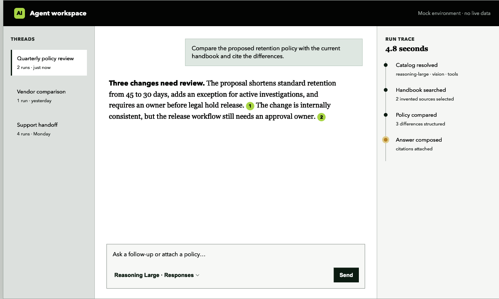
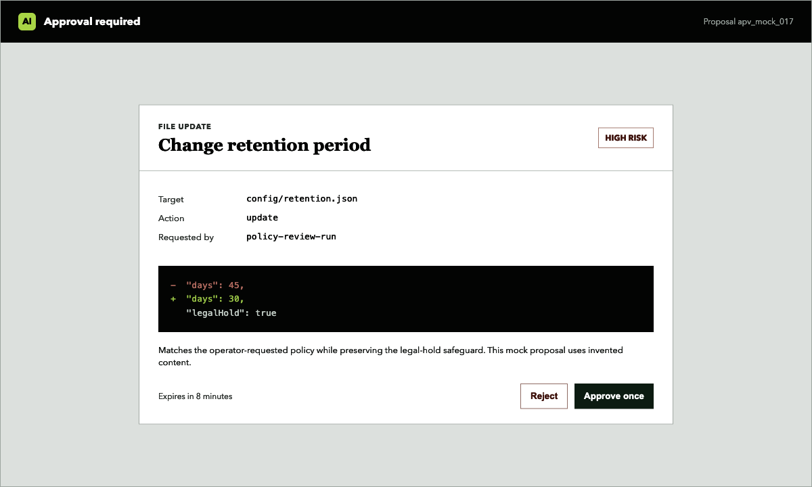

# Agentic AI Bar

**Documentation site:** [ai-bar.ainorthstar.tech/docs](https://ai-bar.ainorthstar.tech/docs/)

Public documentation and mock integration examples for Agentic AI Bar v0.2.0, an embeddable agent command surface and provider-neutral runtime contract.

> [!IMPORTANT]
> This is the public documentation repository. The library package and production applications remain private. The package is not advertised as available from a public registry. Every screenshot, identifier, trace, and data sample here is fictional.



## What ships in v0.2.0

- Provider adapters for OpenAI Responses, OpenAI Chat Completions, native Anthropic Messages, and OpenAI-compatible gateways such as LiteLLM.
- A normalized, discoverable model catalog with capability checks, overrides, caching, and provider error normalization.
- A versioned event protocol for runs, text, reasoning, tools, approvals, artifacts, usage, and errors over SSE, WebSocket, or async iterables.
- Durable thread contracts with optimistic versioning, pagination, editing, regeneration, branch selection, serialization, and resume/cancel operations.
- Background-run checkpoints plus remote-run and sync contracts with explicit conflict resolution.
- Structured tool parts, pluggable renderers, and exact one-time approval continuation state.
- Versioned artifacts, safe preview/download selection, lineage, AG-UI events, and sandboxed MCP App resources.
- Usage, cost, cache, retry, span, and redaction helpers; voice state management; and optional React runtime views.
- Existing v0.1 React, React Native, site-feedback, Worker, and Node file-approval exports remain available.

## Package access

The package is distributed only to authorized private consumers. Use the installation source supplied by the package owner, then import a narrow subpath:

```ts
import { createAgenticRuntime, liteLLM } from "@ainorthstar/agentic-ai-bar/provider-runtime";

const runtime = createAgenticRuntime(
  liteLLM({
    baseURL: process.env.LITELLM_BASE_URL!,
    apiKey: process.env.LITELLM_API_KEY!,
  }),
);

const models = await runtime.listModels();
```

Provider calls and credentials belong in a trusted server, Worker, or local agent. Never bundle provider keys or a user-controlled gateway URL into browser code.

## React composition

```tsx
import { useState } from "react";
import { AgenticComposer, AgenticStageTimeline } from "@ainorthstar/agentic-ai-bar/react";
import { AgenticArtifactList, AgenticRunObservability } from "@ainorthstar/agentic-ai-bar/react-runtime";
import "@ainorthstar/agentic-ai-bar/react.css";
import "@ainorthstar/agentic-ai-bar/react-runtime.css";

export function SupportAgent() {
  const [prompt, setPrompt] = useState("");

  return (
    <main>
      <AgenticStageTimeline stages={[]} />
      <AgenticRunObservability summary={{
        spanCount: 0,
        errorCount: 0,
        retryCount: 0,
        cacheHits: 0,
        latencyMs: 0,
        usage: { inputTokens: 0, outputTokens: 0, reasoningTokens: 0, cachedInputTokens: 0, totalTokens: 0 },
        costByCurrency: {},
      }} />
      <AgenticArtifactList artifacts={[]} />
      <AgenticComposer value={prompt} onChange={setPrompt} onSubmit={() => console.log({ prompt })} models={[]} />
    </main>
  );
}
```

Host applications still own authentication, persistence backends, provider credentials, tool executors, authorization endpoints, queues, and network policy. The package supplies reusable UI, in-memory reference stores, normalized contracts, and protocol helpers; it is not an OS sandbox.

## Exact approvals



```ts
import {
  addToolApprovalRequest,
  consumeApprovedTool,
  createToolApprovalState,
  decideToolApproval,
} from "@ainorthstar/agentic-ai-bar/tool-runtime";

let approvals = createToolApprovalState();
const requested = addToolApprovalRequest(approvals, {
  approvalId: "approval-demo-1",
  toolCallId: "call-demo-1",
  toolName: "update-record",
  input: { recordId: "record-demo-7", status: "reviewed" },
  summary: "Mark the fictional record as reviewed",
  risk: "medium",
  createdAt: new Date().toISOString(),
});
approvals = requested.state;

approvals = decideToolApproval(approvals, {
  approvalId: requested.part.approvalId,
  decision: "approved",
  decidedAt: new Date().toISOString(),
}).state;

const authorized = consumeApprovedTool(
  approvals,
  requested.part.approvalId,
  requested.part.toolName,
  requested.part.input,
);
approvals = authorized.state;
// Execute only authorized.authorization. A second consume fails.
```

The approval is bound to the exact tool name and canonicalized input fingerprint. Rejected calls cannot silently request the same approval again, and approved calls are consumed once. Read [Approvals](docs/approvals.md) before enabling side effects.

## Documentation

- [Browse the documentation site](https://ai-bar.ainorthstar.tech/docs/)
- [Architecture and event protocol](docs/architecture.md)
- [Provider adapters and model catalog](docs/providers.md)
- [Threads, background runs, and sync](docs/runtime.md)
- [Approvals and tool continuation](docs/approvals.md)
- [Tools, artifacts, AG-UI, and MCP Apps](docs/tools-and-artifacts.md)
- [React and platform components](docs/components.md)
- [Observability and voice](docs/observability-and-voice.md)
- [Security model](docs/security.md)
- [Mock examples](examples/README.md)
- [Version and compatibility notes](docs/versioning.md)

## Repository scope

This repository contains documentation, independent mock fixtures, and screenshots rendered from fictional data. It contains no library implementation, production data, real traces, credentials, customer identifiers, or private filesystem paths.

## License

Documentation and mock examples in this repository are available under the [MIT License](LICENSE).
